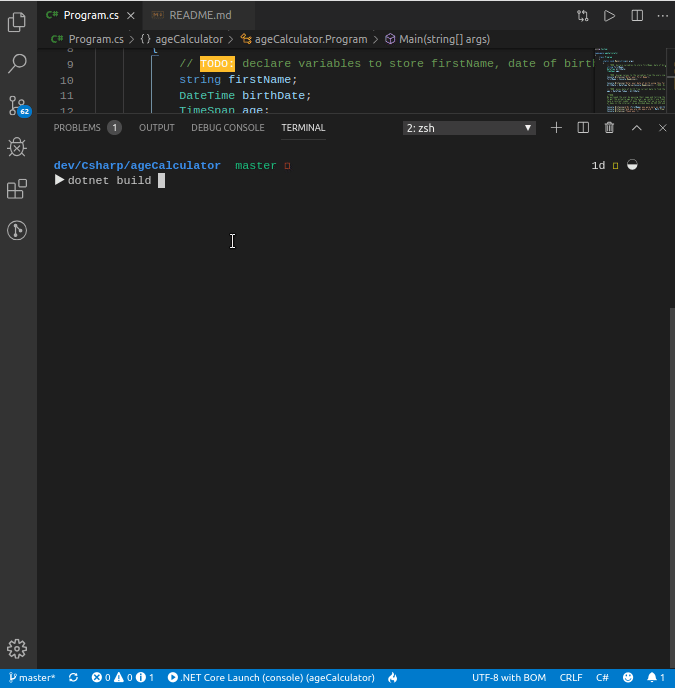

# C# Console Age Calculator

A simple age calculator

# Installation
- Clone this REPO
- Download [.NET](https://dotnet.microsoft.com/download)
- Open this repo on Visual Studio or Visual Studio Code
- If promote to install dependencies in VsCode, click yes
- Press `CTRL+F5` OR type into your terminal `dotnet build && dotnet run` to run the program

# Stack
- C#
- .NET

# Author 
Iroleh